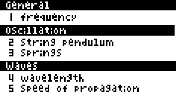

# casio_oscillation_waves 
calculations about oscillations and waves

Until now nothing special. 
Work in progress! 

## Installation

Connect Casio fx-9860 GIII or GII to your Computer with the help of the USB cable. 
Press [F1] 
 
Open the file manager of your operating system and insert the QUADGEN.G1A file into  
the shown device (usually D:). 
 
Eject device (usually D:). More info on calculator display. 
 
Press [EXE] as shown on the screen. 
Press [EXIT] as shown on the screen. 
Press [MENU] as shown on the screen. 
 

# Use
## Main menu

